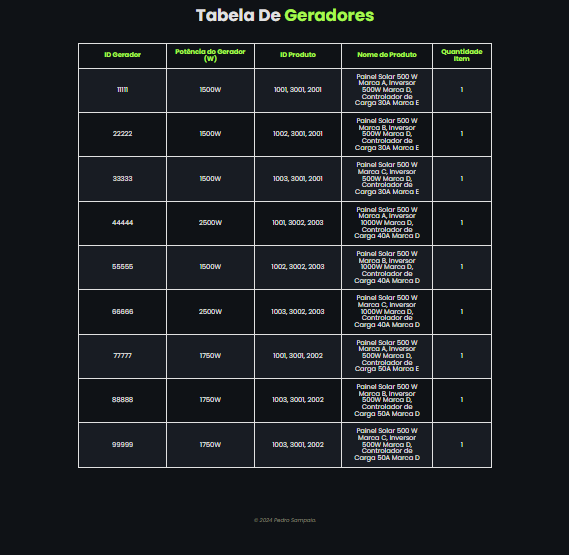
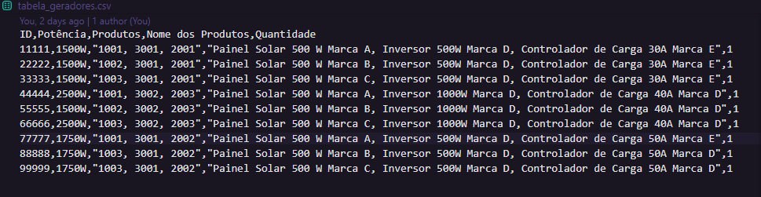
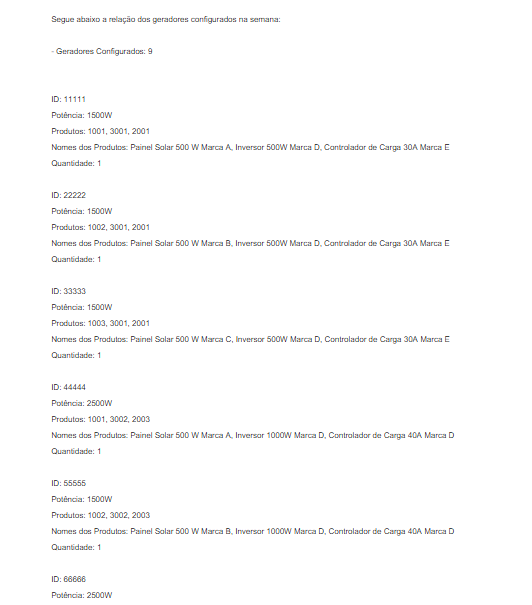
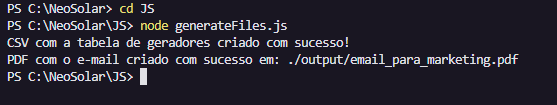

# Neo Solar Generator Case 🌞⚡

## Descrição

O projeto "Neo Solar Generator Case" tem como objetivo transformar componentes fornecidos pela empresa Neo Solar em geradores de energia. Utilizando JavaScript, HTML, CSS e JSON, o projeto gera uma tabela organizada dos componentes e utiliza duas bibliotecas para gerar um e-mail em PDF e um arquivo CSV para o time de marketing.


## Tecnologias Utilizadas 🛠️

- **JavaScript**: Lógica e funcionalidades do projeto.
- **HTML**: Estrutura das páginas web.
- **CSS**: Estilização das páginas web.
- **JSON**: Formato de dados para os componentes.

- **Bibliotecas**:
  - **pdf-lib**: Para gerar e-mails em PDF 📄.
  - **csv-writer**: Para gerar arquivos CSV 📊.

## Instalação 🛠️

1. **Clone o repositório**:

   ```bash
   git clone https://github.com/usuario/neo-solar-generator-case.git


Uso 🚀
1. **Abra o arquivo `index.html`** no navegador para visualizar a tabela dos geradores 

Gerar Tabela:

A tabela será automaticamente gerada e exibida na página principal (index.html).

Gerar PDF e CSV:

Navegue até o diretório JS onde os scripts para gerar os arquivos estão localizados e execute o comando:
node generateFiles
Esse comando executará o script que utiliza as bibliotecas para gerar automaticamente:

Um e-mail em PDF 📄
Um arquivo CSV 📊

Exemplos 📸













Contribuição 🤝

Fork o repositório.
Crie uma nova branch (git checkout -b feature/novafeature).
Faça suas alterações e adicione testes, se necessário.
Envie suas mudanças (git commit -am 'Add new feature').
Push para a branch (git push origin feature/novafeature).
Crie um Pull Request.

Licença 📜
Este projeto está licenciado sob a Licença MIT. Veja o arquivo LICENSE para mais detalhes.

Contato 📬

Para mais informações, entre em contato com o desenvolvedor:

Nome: Pedro Sampaio
E-mail: pedrosampaio11@icloud.com
LinkedIn: https://www.linkedin.com/in/pedro-tuquim

